# Laporan Proyek Machine Learning

### Nama : Mochammad Revan Haerudin

### Nim : 211351084

### Kelas : Malam A

## Domain Proyek

Aplikasi ini dirancang untuk membuat segmentasi tingkat kebahagiaan suatu negara berdasarkan sejumlah faktor yang dapat mempengaruhinya. Data yang digunakan akan mencakup empat faktor yaitu ekonomi, kualitas hubungan keluarga, harapan hidup atau tingkat kesehatan masyarakat dan bagaimana masyarakat di negara tersebut merasa bebas.

## Business Understanding

Memberikan wawasan yang mendalam kepada pemerintah, atau peneliti tentang faktor-faktor yang mempengaruhi tingkat kebahagiaan suatu negara.

### Problem Statements

Ketidaktahuan akan faktor-faktor yang berkontribusi terhadap tingkat kebahagiaan suatu negara sering kali menjadi kendala dalam merumuskan kebijakan yang efektif.

### Solution statements

Membuat aplikasi mengevaluasi faktor ekonomi, kualitas hubungan keluarga, harapan hidup, dan persepsi kebebasan hidup disuatu negara dengan segmentasi tingkat kebahagiaan negara suatu negara.

### Goals

Mengimplementasikan algoritma K-Means pada aplikasi untuk melakukan segmentasi terhadap data kebahagiaan negara berdasarkan faktor-faktor yang dipilih.

## Data Understanding

World Happiness Report dataset adalah datasets yang saya gunakan. Data-data yang terdapat di dalam datasets ini didapatkan dari data Gallup World Poll. Datasets ini mengandung 12 Kolom dan 158 data(baris) pada saat sebelum pemrosesan data cleasing.

### Variabel-variabel pada data set yang digunakan adalah sebagai berikut:

-   Country : Nama negara yang bersangkutan. [object]
-   Region : Daerah atau bagian dunia di mana negara tersebut terletak. [object]
-   Happiness Rank : Peringkat negara berdasarkan skor Kebahagiaan. [int64]
-   Happiness Score : skor kebahagian suatu negara dengan bertanya kepada sejumlah orang sampel pertanyaan: "Bagaimana Anda menilai tingkat kebahagiaan Anda dalam skala 0 hingga 10 di mana 10 adalah yang paling bahagia. [float64]
-   Standard Error : Ukuran seberapa besar kemungkinan variasi atau deviasi skor Kebahagiaan dari nilai sebenarnya. [float64]
-   Economy (GDP per Capita) : Sejauh mana GDP berkontribusi dalam perhitungan skor Kebahagiaan. [float64]
-   Family : Sejauh mana kontribusi dukungan keluarga dan hubungan sosial terhadap terhadap skor Kebahagiaan. [float64]
-   Health (Life Expectancy) : Harapan hidup berkontribusi terhadap perhitungan skor Kebahagiaan. [float64]
-   Freedom : Sejauh mana kebebasan berkontribusi terhadap perhitungan skor Kebahagiaan. [float64]
-   Trust (Government Corruption) : Seberapa besar persepsi terhadap korupsi dalam pemerintahan berkontribusi terhadap skor Kebahagiaan. [float64]
-   Generosity : Seberapa besar kontribusi Kemurahan Hati terhadap perhitungan Skor Kebahagiaan. [float64]
-   Dystopia Residual : Sejauh mana Dystopia Residual berkontribusi dalam perhitungan Skor Kebahagiaan. [float64]

## Data Preparation

### Import Dataset

Pertama kita mondownload datasets dari kaggle.

```python
from google.colab import files
files.upload()
```

```python
!mkdir -p ~/.kaggle
!cp kaggle.json ~/.kaggle/
!chmod 600 ~/.kaggle/kaggle.json
!ls ~/.kaggle
```

```python
!kaggle datasets download -d matthieugimbert/french-bakery-daily-sales
```

Lalu mengekstrak filenya.

```python
!mkdir world-happiness
!unzip world-happiness.zip -d world-happiness
!ls world-happiness
```

### Import library

```python
import pandas as pd
import numpy as np
import matplotlib.pyplot as plt
import seaborn as sns

from sklearn.cluster import KMeans
import plotly.graph_objs as go
from plotly.offline import iplot
```

### Data Discovery

Kita buat variable untuk menyimpan dataset

```python
df = pd.read_csv('/content/world-happiness/2015.csv')
```

Lihat 5 data sampel data

```python
df.head()
```

Informasi dataset setiap kolom, bisa kita lihat seperti tipe data tiap kolom, nama kolom dan lain-lain

```python
df.info()
```

Describe dataframe

```python
df.describe()
```

Kita lihat apakah ada kolom yang memilki nilai null? ternyata tidak, semua data tidak ada yang null

```python
df.isnull().sum()
```

Melihat banyak kolom dan baris pada dataframe

```python
df.shape
```

Karena kita orang Indonesia mari kita lihat data Indonesia, ternyata Indonesia peringkat ke 74 dari total 158 negara

```python
df.loc[df['Country']=='Indonesia']
```

### EDA

Mari kita lihat top 10 negara dengan kriteria yang berbeda beda

```python
fig, axes = plt.subplots(nrows=2, ncols=2,constrained_layout=True,figsize=(12,8))

sns.barplot(x='Economy (GDP per Capita)',y='Country',data=df.nlargest(10,'Economy (GDP per Capita)'),ax=axes[0,0],palette="Blues_d")
sns.barplot(x='Family' ,y='Country',data=df.nlargest(10,'Family'),ax=axes[0,1],palette="YlGn")
sns.barplot(x='Health (Life Expectancy)' ,y='Country',data=df.nlargest(10,'Health (Life Expectancy)'),ax=axes[1,0],palette='OrRd')
sns.barplot(x='Freedom' ,y='Country',data=df.nlargest(10,'Freedom'),ax=axes[1,1],palette='YlOrBr')
```

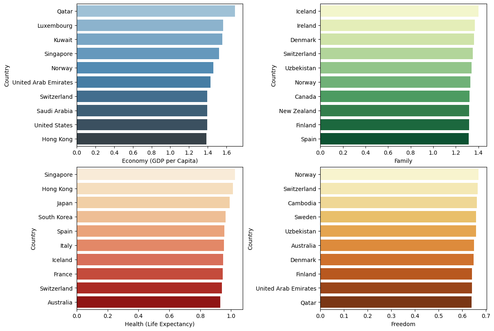

Dan kita lihat 10 top negara berdasarkan Happiness Score, Switzerland berada pada tingkat ke 1. Dapat kita lihat Switzerland selalu ada dalam top 10, ini artinya kriteria diatas memiliki korelasi pada Happiness Score

```python
plt.figure(figsize=(8, 6))
sns.barplot(x='Happiness Score', y='Country', data=df.nlargest(10, 'Happiness Score'), palette="Blues_d")
plt.title('Top 10 Countries by Happiness score')
plt.xlabel('Happiness score')
plt.ylabel('Country')

plt.show()
```

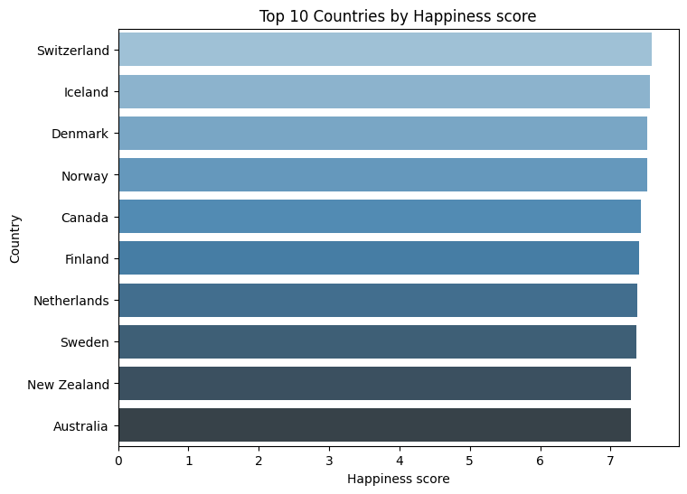

Sedangkan disini Myanmar dengan generosity dan Rwanda dengan Trust Goverment Corruption tertinggi, tidak pernah ada dalam top 10 kriteria diatas, dapat kita simpulkan generosity dan Trust Goverment Corruption memiliki korelasi yang tidak begitu kuat dengan kritia diatas. Dan Indonesia masuk ke top 5 informasi yang menarik

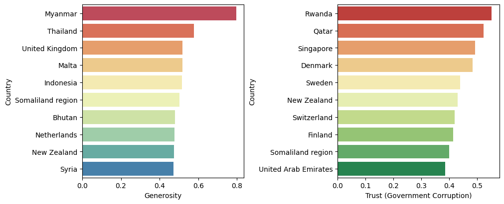

Menampilkan Globe dengan happines score pada setiap negara

```python
data = dict(type = 'choropleth',
           locations = df['Country'],
           locationmode = 'country names',
           colorscale='RdYlGn',
           z = df['Happiness Score'],
           text = df['Country'],
           colorbar = {'title':'Happiness Score'})

layout = dict(title = 'Geographical Visualization of Happiness Score',
              geo = dict(showframe = True, projection = {'type': 'azimuthal equal area'}))

choromap3 = go.Figure(data = [data], layout=layout)
iplot(choromap3)
```

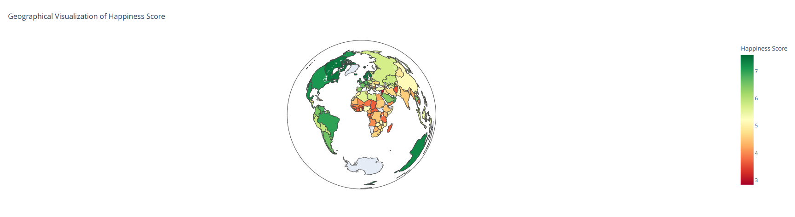

Selnjutnya kita lihat korelasi antar kolom, dapat kita lihat happiness score dengan Economy (GDP per Capita) memilki korelasi paling tinggi yaitu 0.78

```python
sns.heatmap(df.corr(), annot=True, cmap="crest")
```

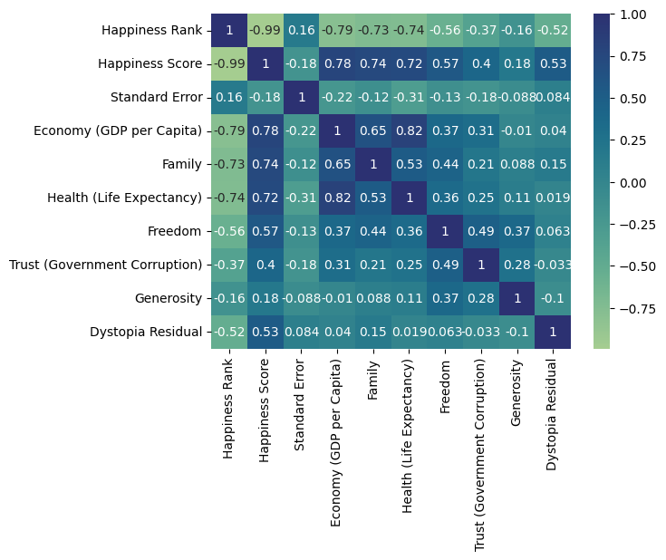

### Preprocessing

Selanjutnya kita akan melakukan proses preprocessing, pertama membuat dataframe baru dengan menghapus kolom-kolom yang tidak diperlukan

```python
X = df.drop(["Region", "Happiness Rank", "Standard Error", "Dystopia Residual", "Generosity","Trust (Government Corruption)","Country"], axis=1)
```

Ubah nama kolom yang terlalu panjang dan ingin digunakan

```python
X.rename(index=str, columns={
    "Happiness Score" : "Score",
    "Economy (GDP per Capita)" : "Economy",
    "Health (Life Expectancy)" : "Health",
}, inplace=True)
```

Tampilkan data setelah diubah

```python
X
```

Sipp proses preprocessing kita sudah selesai selanjutnya kita akan ke tahap modeling

## Modeling

Pertama kita akan mencari elbow yang memungkinkan

```python
cluster = []
for i in range(1,11):
    km = KMeans(n_clusters=i).fit(X)
    cluster.append(km.inertia_)

fig, ax = plt.subplots(figsize=(20,8))
sns.lineplot(x=list(range(1,11)), y=cluster, ax=ax)
ax.set_title("Mencari elbow")
ax.set_xlabel("clusters")
ax.set_ylabel("inertia")

ax.annotate("Possible elbow point", xy=(3,10), xytext=(3, 100), xycoords="data",
            arrowprops=dict(arrowstyle="->", connectionstyle="arc3", color="blue", lw=2))

ax.annotate("Possible elbow point", xy=(5, 10), xytext=(6, 100), xycoords="data",
            arrowprops=dict(arrowstyle="->", connectionstyle="arc3", color="blue", lw=2))
```

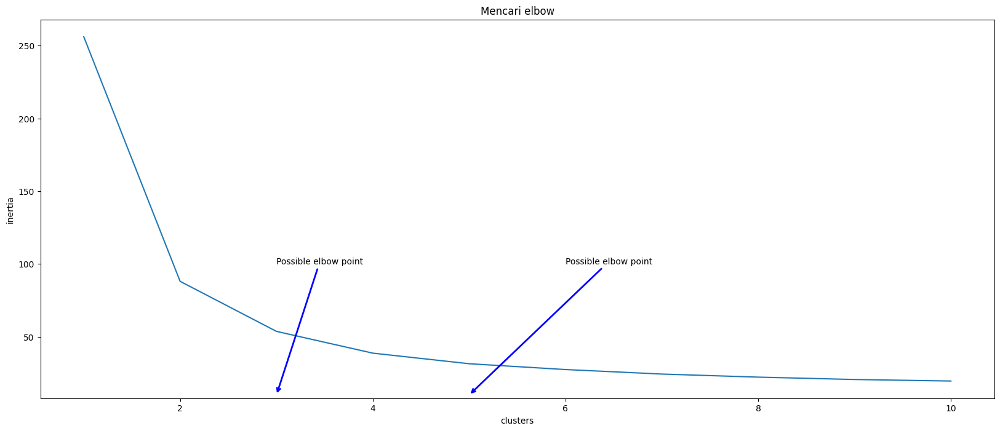

Disini 3,4,5 memungkinkan untuk dijadikan cluster, tetapi kita akan mengambil nilai tengah yaitu 4 sebagai n_clust

```python
n_clust = 4
kmean = KMeans(n_clusters=n_clust).fit(X)
X["Labels"] = kmean.labels_
```

Selanjutnya akan kita lihat hasil clustering pada tahap visualisasi algoritma

### Visuliasai hasil algoritma

Disini kita sudah membagi cluster menjadi 4 dan dapat kita lihat semakin tinggi nilai X semakin tinggi nilai y (Happines Score) artinya faktor-faktor X memiliki korelasi positif dengan y

```python
plt.figure (figsize=(10,8))
sns.scatterplot(x='Economy', y='Score', hue='Labels', size='Labels', palette=sns.color_palette('hls', n_clust), data=X, markers=True)

for label in X['Labels']:
  plt.annotate (label,
  (X[X['Labels']==label]['Economy'].mean(),
   X[X['Labels'] ==label]['Score'].mean()),
   horizontalalignment = 'center',
   verticalalignment = 'center',
   size = 20, weight='bold',
   color = 'black')
```

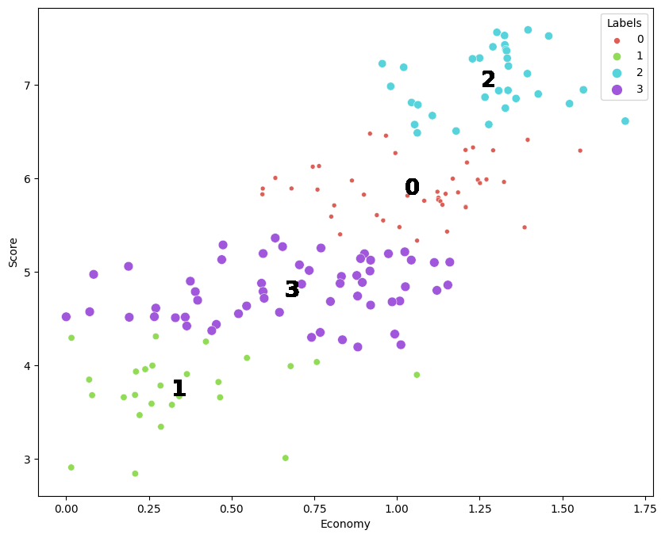

```python
plt.figure (figsize=(10,8))
sns.scatterplot(x='Health', y='Score', hue='Labels', size='Labels', palette=sns.color_palette('hls', n_clust), data=X, markers=True)

for label in X['Labels']:
  plt.annotate (label,
  (X[X['Labels']==label]['Health'].mean(),
   X[X['Labels'] ==label]['Score'].mean()),
   horizontalalignment = 'center',
   verticalalignment = 'center',
   size = 20, weight='bold',
   color = 'black')
```

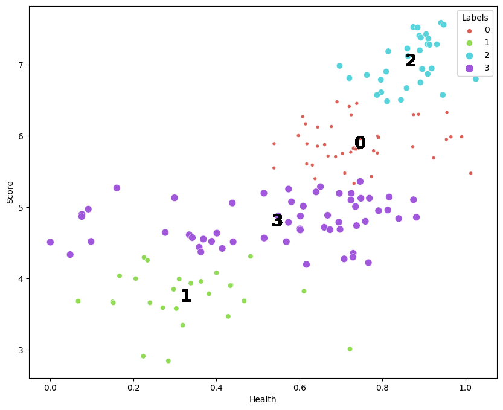

```python
plt.figure (figsize=(10,8))
sns.scatterplot(x='Freedom', y='Score', hue='Labels', size='Labels', palette=sns.color_palette('hls', n_clust), data=X, markers=True)

for label in X['Labels']:
  plt.annotate (label,
  (X[X['Labels']==label]['Freedom'].mean(),
   X[X['Labels'] ==label]['Score'].mean()),
   horizontalalignment = 'center',
   verticalalignment = 'center',
   size = 20, weight='bold',
   color = 'black')
```

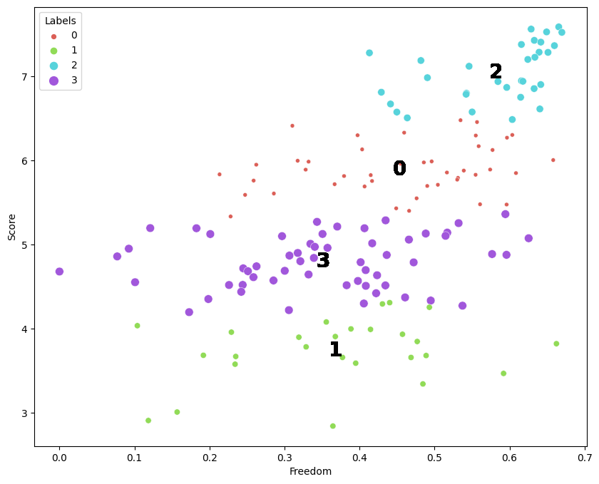

```pyton
plt.figure (figsize=(10,8))
sns.scatterplot(x='Family', y='Score', hue='Labels', size='Labels', palette=sns.color_palette('hls', n_clust), data=X, markers=True)

for label in X['Labels']:
  plt.annotate (label,
  (X[X['Labels']==label]['Family'].mean(),
   X[X['Labels'] ==label]['Score'].mean()),
   horizontalalignment = 'center',
   verticalalignment = 'center',
   size = 20, weight='bold',
   color = 'black')
```

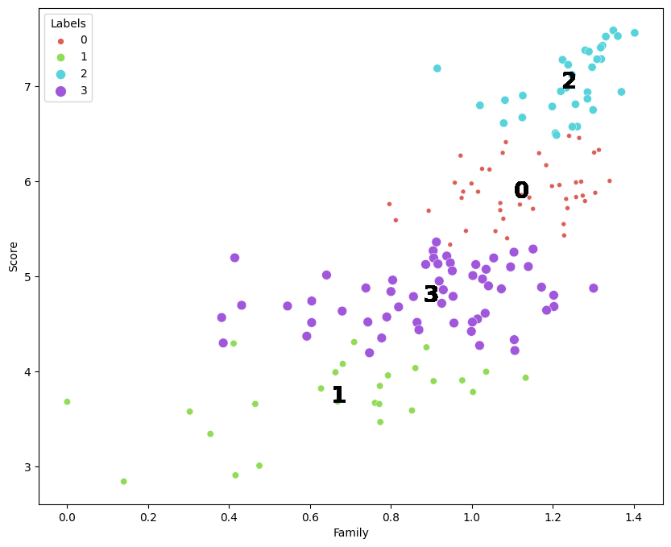

## Deployment

Streamlit : [World Hapiness Factor | Revan](https://world-happiness-factor.streamlit.app/)  

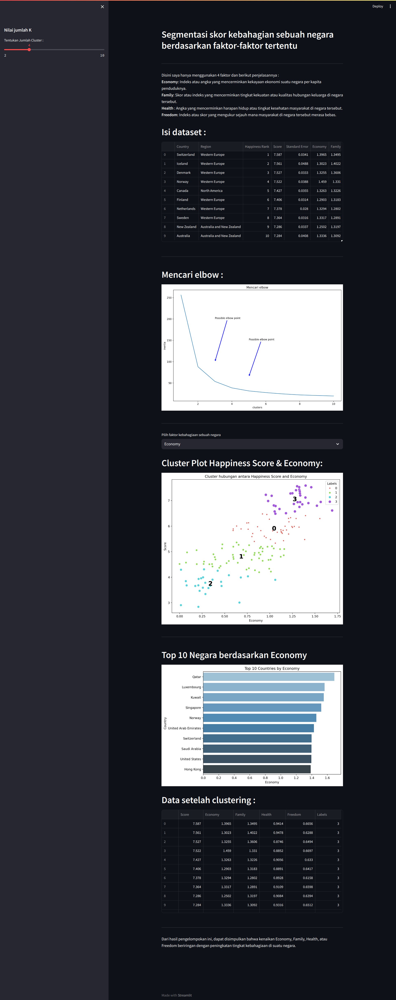
